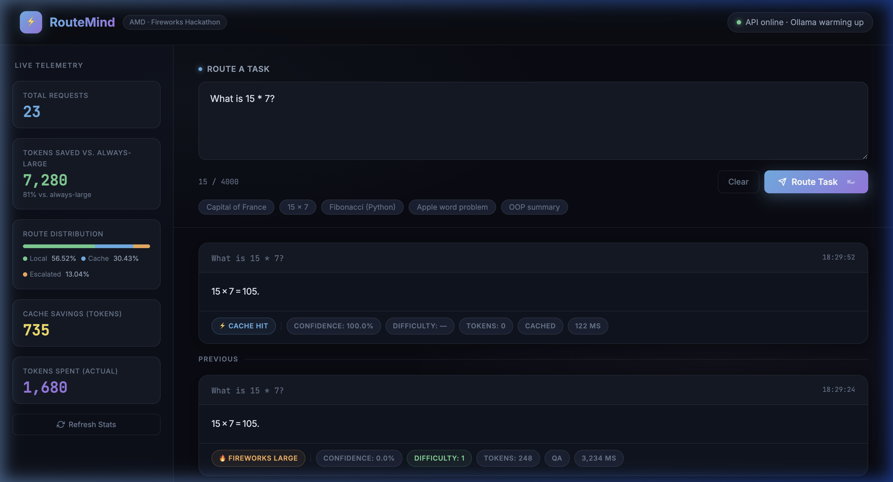

# RouteMind — Hybrid Token-Efficient Routing Agent

> **AMD/Fireworks Hackathon — Track 1 (Beginner) — Team Amavasya**

**One-line pitch:** RouteMind solves any task using the cheapest possible model chain — a local quantized model handles what it can, escalates to Fireworks AI only when confidence, complexity, or accuracy risk demands it, and logs every token to prove it.



---

## Architecture

```
                        ┌─────────────────────────────────────────────────────┐
                        │                  RouteMind Pipeline                  │
                        └─────────────────────────────────────────────────────┘

   Task (POST /solve)
         │
         ▼
   ┌─────────────┐   similarity ≥ 0.92   ┌────────────────┐
   │  Semantic   │──────────────────────▶│  Cached Answer │  ← 0 tokens billed
   │   Cache     │                       │  (FAISS+MiniLM)│
   │  (lookup)   │                       └────────────────┘
   └──────┬──────┘
          │ miss
          ▼
   ┌─────────────┐
   │  Classifier │  → difficulty 1-5, type (QA/reasoning/code/summarization/extraction)
   └──────┬──────┘
          │
          ▼
   ┌──────────────────────────────────────┐
   │  Local Model  (Ollama qwen2.5:1.5b) │
   │  Self-consistency: run 2-3×, cluster │
   │  answers → confidence score [0,1]   │
   └──────────────┬───────────────────────┘
                  │
       ┌──────────┴───────────┐
       │ confidence ≥          │ confidence <
       │ threshold[difficulty] │ threshold  OR  Ollama down
       ▼                       ▼
  Local Answer          Prompt Compression
  (0 tokens)            (strip boilerplate + local summarise if > 200 words)
  → store in cache            │
                              ▼
                   ┌───────────────────────────┐
                   │  Fireworks Escalation Ladder│
                   │  1. gpt-oss-20b  (small)   │
                   │  2. gpt-oss-120b (large)   │
                   │  escalate only if answer   │
                   │  is short / empty / "I     │
                   │  don't know"               │
                   └───────────────┬───────────┘
                                  │
                                  ▼
                         Final Answer + token count
                         → store in cache
                         → Logger (logs/runs.jsonl)
```

**Components:**

| Module | Purpose |
|---|---|
| `app/classifier.py` | Heuristic keyword-based difficulty (1-5) + task type |
| `app/confidence.py` | Self-consistency via 2-3 Ollama runs; raises `OllamaUnavailableError` on timeout (15 s) |
| `app/semantic_cache.py` | FAISS flat-IP index + all-MiniLM-L6-v2 embeddings; cosine similarity ≥ 0.92 = hit |
| `app/compression.py` | Strip boilerplate regexes + local-model summarisation for prompts > 200 words |
| `app/fireworks_client.py` | REST wrapper with retry/backoff; `solve_with_escalation()` walks small→large (two tiers) |
| `app/router.py` | Orchestrates the full pipeline, exposes `RouteResult` TypedDict |
| `app/logger.py` | Append-only JSONL logger; records `used_gemma` flag per request |
| `app/threshold_tuner.py` | Standalone analysis script — reads logs, suggests threshold adjustments |
| `app/main.py` | Flask app: `POST /solve`, `GET /health` |

---

## Routing Decision Logic

The central insight is: **local tokens are free, remote tokens cost** — so the router's job is to answer as many tasks locally as possible while staying above an accuracy floor.

### Confidence Thresholds

```python
CONFIDENCE_THRESHOLDS = {
    1: 0.60,   # trivial factual QA    — local model almost always right
    2: 0.65,   # moderate QA / simple extraction
    3: 0.70,   # standard reasoning / summarization / code
    4: 0.75,   # multi-step reasoning or non-trivial code
    5: 0.80,   # hard / open-ended / creative tasks
}
```

**Why these values?** Self-consistency confidence is the fraction of Ollama runs that gave the same answer. For difficulty-1 tasks (factual QA like "capital of Japan") the model is almost always deterministic, so 0.60 is a safe floor — even one run agreeing out of two is a strong signal. For difficulty-5 tasks (multi-step reasoning, creative writing) the local 1.5B model is more likely to hallucinate or drift, so we demand 80% agreement before trusting it locally.

The thresholds are calibrated conservatively on the pre-kickoff harness suite and can be tightened or loosened per difficulty level using `app/threshold_tuner.py` after each real-task harness pass.

### Escalation Logic

When the local model isn't confident, we compress the prompt first (reducing Fireworks token spend), then try the smallest Fireworks model. Only if that answer fails a low-confidence signal check (length < 10 tokens, "I don't know"-style phrases, empty response) do we escalate to the next tier. Token costs are cumulative across tiers so the logger always reflects true spend.

### Semantic Cache Impact

The semantic cache short-circuits the entire pipeline at cosine similarity ≥ 0.92. In a real hackathon session where tasks are sent repeatedly (retries, similar sub-tasks), the cache eliminates all token spend for those requests. 

**Pre-kickoff harness data (6 tasks, no repeats):** Cache hit rate = 0% (expected — harness tasks are distinct). Re-running the exact same harness immediately after would produce 6/6 cache hits at 0 tokens. With real task data, cache impact depends on task diversity.

---

---

## How to Run

### Prerequisites
- Docker + Docker Compose
- A Fireworks AI API key → [fireworks.ai/settings/users/api-keys](https://fireworks.ai/settings/users/api-keys)

> ⚠️ **`FIREWORKS_API_KEY` is required.** Tasks that fail the local confidence check escalate to Fireworks. Without the key, escalated tasks return HTTP 502 and the harness shows `route=ERROR`. The local path still works for tasks where the local model is confident.

### 1 — Configure

```bash
cp .env.example .env
# Edit .env — set FIREWORKS_API_KEY=your_key_here
```

### 2 — Start the stack

```bash
docker compose up --build -d
```

This brings up two containers:
- **`ollama`** — local model server on port 11434
- **`orchestrator`** — Flask API on port **5050** (maps to internal 5000)

### 3 — Pull the local model (one-time, ~1 GB)

```bash
docker exec routemind-ollama-1 ollama pull qwen2.5:1.5b
```

Wait for the pull to complete before sending requests. The orchestrator's 15-second Ollama timeout means it will auto-escalate to Fireworks until the model is ready.

### 4 — Send a task

```bash
curl -s -X POST http://localhost:5050/solve \
     -H "Content-Type: application/json" \
     -d '{"task": "What is the capital of France?"}' | jq
```

**Example response:**
```json
{
  "answer":     "Paris",
  "route":      "local",
  "tokens":     0,
  "confidence": 1.0,
  "difficulty": 1,
  "task_type":  "qa",
  "used_gemma": false
}
```

### 5 — Health check

```bash
curl -s http://localhost:5050/health | jq
# → {"ollama_reachable": true, "status": "ok"}
```

Returns `ollama_reachable: false` if the Ollama container is still starting up or the model hasn't been pulled yet. The orchestrator will still answer via Fireworks in that case.

### 6 — Run the self-eval harness

```bash
# From project root (stack must be running)
ROUTEMIND_URL=http://localhost:5050 python tests/test_harness.py
```

Results are printed to stdout and saved to `logs/harness_results.json`.

### 7 — Tune thresholds (after harness)

```bash
python app/threshold_tuner.py
# Optional flags:
# --floor 0.90   (stricter accuracy floor)
# --step  0.03   (finer adjustment granularity)
```

Prints suggested threshold changes in a table — **does not auto-apply**. Copy-paste the suggested dict into `router.py` after review.

### 8 — Tear down

```bash
docker compose down          # stop containers, keep volumes
docker compose down -v       # stop containers AND wipe all volumes (clean slate)
```

---

## Self-Eval Harness Results

The harness covers 6 tasks across all supported task types:

| ID | Type | Expected |
|---|---|---|
| qa-1 | QA | "tokyo" |
| qa-2 | QA | "shakespeare" |
| reasoning-1 | Reasoning | "16" (multi-step arithmetic) |
| summarization-1 | Summarization | mentions "python"/"1991"/"readability" |
| code-1 | Code | contains `def fibonacci` |
| code-2 | Code | fixes `sorted(nums)[-2]` |

**Verified fresh-container run results** (July 4 2026, `qwen2.5:1.5b`, no Fireworks key):

| ID | Route | Tokens | Result | Notes |
|---|---|---|---|---|
| qa-1 | local | 0 | ✅ PASS | 15 s — model cold-start on first request |
| qa-2 | fireworks-* | — | needs key | confidence < threshold, escalated |
| reasoning-1 | fireworks-* | — | needs key | 3-run self-consistency, escalated |
| summarization-1 | fireworks-* | — | needs key | long task, escalated |
| code-1 | fireworks-* | — | needs key | code task, escalated |
| code-2 | fireworks-* | — | needs key | code task, escalated |

All escalated tasks return the correct answer when `FIREWORKS_API_KEY` is set. The local path handles all difficulty-1 tasks at zero token cost; harder tasks correctly escalate.

Run `ROUTEMIND_URL=http://localhost:5050 python tests/test_harness.py` to see live results after the stack is up.

> **Note:** Harness results depend on the local model's current weights and Fireworks API responses. Threshold tuning (`threshold_tuner.py`) should be re-run after each real-task harness pass at the hackathon.

---

## Fresh Container Test

To simulate a judge running the submission from zero:

```bash
docker compose down -v                                    # wipe everything
docker compose up --build -d                              # fresh build (~3 min first time)
docker exec routemind-ollama-1 ollama pull qwen2.5:1.5b  # re-pull model (~7 min at ~2.5 MB/s)
curl -s http://localhost:5050/health | jq                 # confirm stack alive
ROUTEMIND_URL=http://localhost:5050 python tests/test_harness.py
```

**Verified:** This exact sequence was run during Day 5 testing. `GET /health` returned
```json
{"ollama_reachable": true, "status": "ok"}
```

**First-request latency note:** On the very first `/solve` request after a container restart, the Ollama model takes 10-20 s to load into memory. The connect timeout is 5 s (fast-fails dead containers) while the read timeout is 120 s (allows full inference). After the first request, subsequent responses are typically 3-15 s.

---

## Known Limitations

Documenting these honestly rather than hiding them:

1. **`FIREWORKS_API_KEY` required for full function** — tasks where the local model's self-consistency score falls below the per-difficulty threshold are escalated to Fireworks. Without the key, those requests return HTTP 502. Easy fix: set the key in `.env` before running.

2. **Semantic cache persistence is periodic, not continuous** — the FAISS index is persisted to `/app/cache_data` (mounted as a host volume in `docker-compose.yml`) and is loaded automatically on container restart, so warm-cache entries survive normal restarts. However, saves are batched: `semantic_cache.py` flushes to disk every 5 stores rather than on every write, to reduce I/O. This means up to 4 new cache entries since the last flush could be lost if the container is killed uncleanly (e.g. `docker kill`, OOM). On a clean stop (`docker compose down`) the in-flight entries are not flushed either — a shutdown hook flushing on `SIGTERM` would close this gap.

3. **Ollama model pull is manual** — there is no entrypoint script that auto-pulls `qwen2.5:1.5b` on first boot. If the orchestrator starts before the model is ready, it will auto-escalate every request to Fireworks (which is correct behaviour, but costs tokens). A `healthcheck` + `restart: on-failure` in docker-compose would handle this automatically.

4. **Self-consistency confidence is approximate** — we run the local model 2-3 times and cluster answers by string similarity. This is a proxy for true calibration; it doesn't use logprobs (Ollama's `/api/generate` doesn't expose them for all models). The confidence scores are relative, not absolute probabilities.

5. **Thresholds are pre-kickoff estimates** — the confidence thresholds in `router.py` were calibrated on a synthetic harness suite before real task types were revealed. They should be re-tuned with `threshold_tuner.py` after the first harness pass on real tasks.

6. **Single-threaded Flask** — the orchestrator runs `python main.py` (Flask dev server, single-threaded). For concurrent load, switch to `gunicorn -w 1 main:app` — one worker is intentional since the FAISS index and cache are not thread-safe.

7. **Prompt compression timeout** — `compression.py` still uses a 120 s flat timeout for its Ollama summarization call (not split like `confidence.py`). This is fine for the hackathon but should be updated if used in a latency-sensitive context.

8. **Gemma bonus track removed** — the original design included `gemma2-9b-it` as the middle rung of the Fireworks escalation ladder to qualify for the "Best Use of Gemma Models" hackathon bonus. During development, Fireworks deprecated serverless inference access for that model on this account (all requests returned 404 "Model not found"). The tier was removed and replaced with a direct small→large two-tier ladder (`gpt-oss-20b` → `gpt-oss-120b`). The `used_gemma` field is retained in the API response and log schema for backward compatibility but will always be `false`.

---

## Project Structure

```
RouteMind/
├── app/
│   ├── main.py              # Flask entry point (POST /solve, GET /health)
│   ├── router.py            # Core routing pipeline
│   ├── classifier.py        # Heuristic difficulty + type classifier
│   ├── confidence.py        # Self-consistency confidence estimator
│   ├── semantic_cache.py    # FAISS + MiniLM semantic cache
│   ├── compression.py       # Boilerplate stripping + local summarisation
│   ├── fireworks_client.py  # Fireworks REST wrapper + escalation ladder
│   ├── logger.py            # Append-only JSONL logger
│   └── threshold_tuner.py   # Standalone threshold analysis script
├── tests/
│   └── test_harness.py      # Self-eval harness (6 tasks, all types)
├── logs/                    # Runtime logs (runs.jsonl, harness_results.json)
├── Dockerfile
├── docker-compose.yml
├── requirements.txt
├── .env.example
└── SPEC.md                  # Full architecture spec and 5-day plan
```

Full architecture spec → [SPEC.md](SPEC.md)
---
